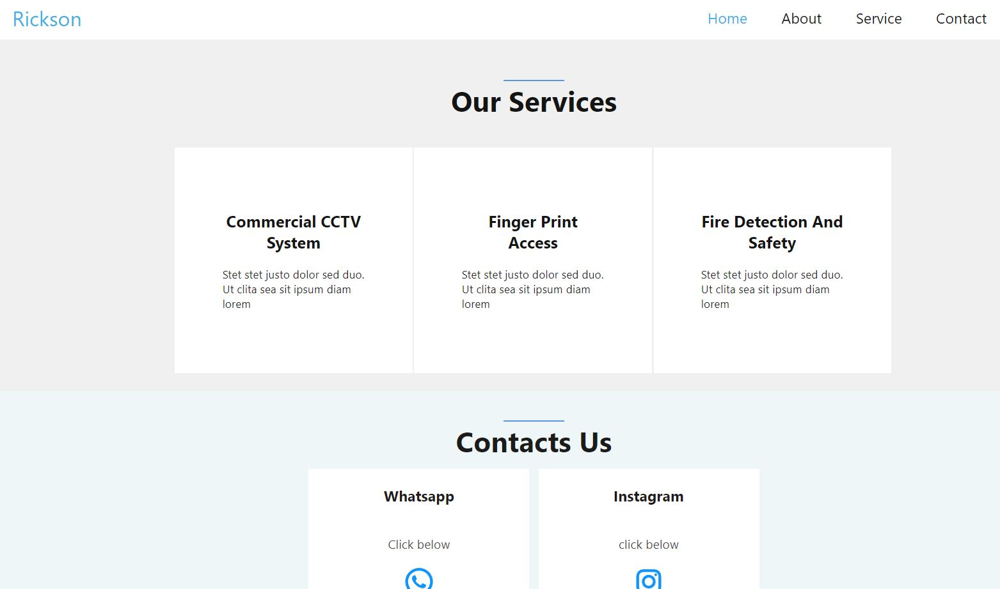
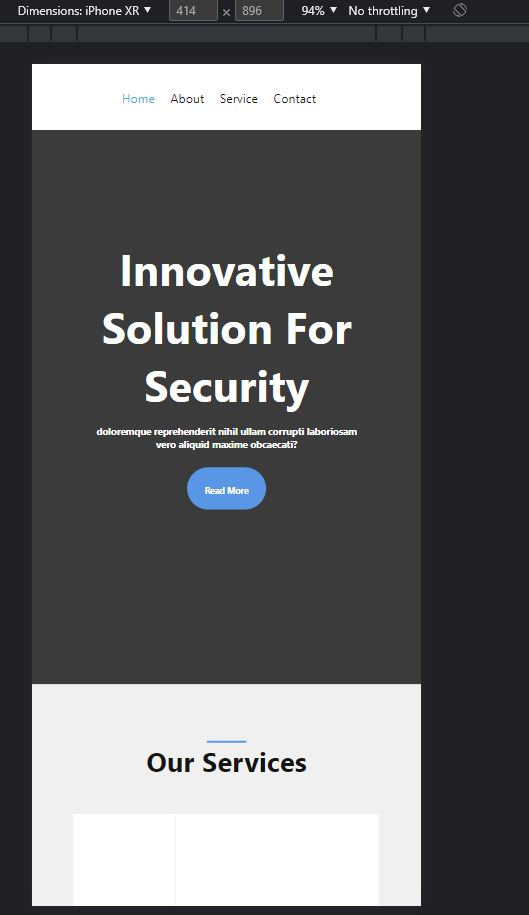
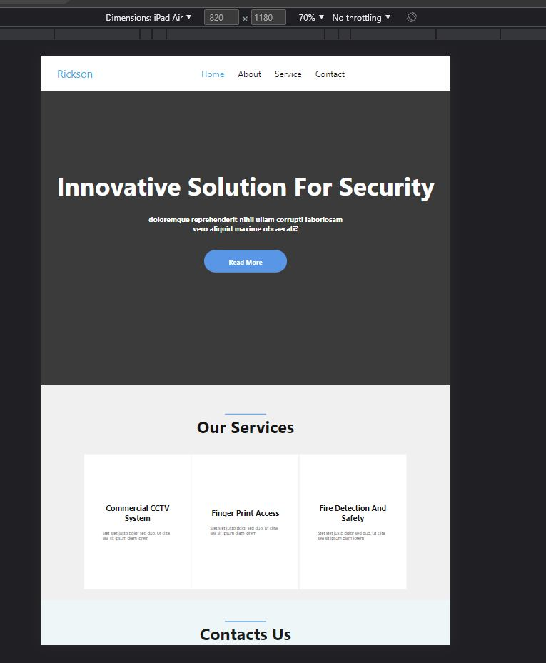

<h1>Security Landpage Using HTML 5 and CSS</h1>  
</h4>

<h4>To Access the Page Click Below - Para Acessar a Página click abaixo</h4>
<a  href="https://lewisc99.github.io/security-work-static-landing-page/Index.html">Click here</a>

 
<h2>Description English</h2>

 Just a simple Page to test responsive website page with new Features, The best exemple to use A responsible Website,
using less code, This page can be fit to any Size of Screen, and the User can Zoom Out and In to any size 

 
<h2>Descrição Português</h2>

Apenas uma página simples para testar a página do site responsivo com novos recursos,
 o melhor exemplo para usar um site responsável, usando menos código, 
esta página pode ser ajustada a qualquer tamanho de tela e o usuário pode diminuir e Aumentar o zoom em qualquer tamanho

 

 
 

### Stack:

* [HTML Basic](https://www.w3schools.com/html/)
* [CSS Basic](https://developer.mozilla.org/pt-BR/docs/Web/CSS)

## 🚀 Let's code! 🚀
